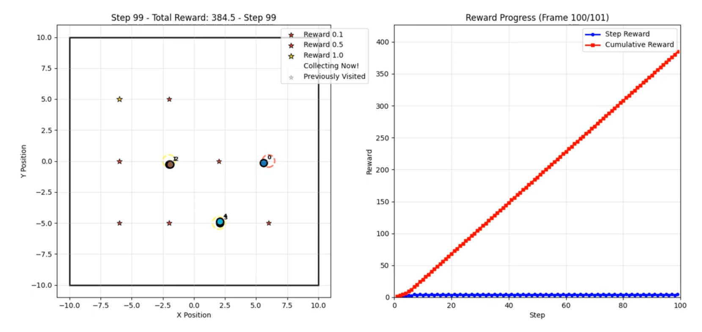

# ODMAR - Optimistic Distributed Multi-Agent Reinforcement Learning

This repository implements the ODMAR algorithm, which combines distributed model-based reinforcement learning with optimistic exploration strategies. The code is designed to work with multiple agents in a shared environment, leveraging both real and imaginary data for training.

As a baseline, ODMAR is compared against standard SAC agents that do not share a world model or transition data:


## Structure
- `odmar.py`: Main script with the ODMAR implementation and the main running script.
- `distributed_gp.py`: Contains the distributed GP model example shown in the paper.
- `env.py`: Contains the `MultiAgentEnvironment` class, which simulates a multi-agent reward-collection task environment.

## Key Features
- **Distributed Model Training**: Each agent maintains its own model, which is updated via a distributed communication protocol to reach a common world-model over all agents after reaching consensus.
- **Optimistic Exploration**: The algorithm uses optimism in the face of uncertainty to encourage exploration, particularly in sparse reward environments, as in this sparse reward collection task.

## Requirements
A requirements file is provided to set up the necessary Python environment. You can install the dependencies using venv or conda. Here is how to set it up using venv:

```bash
virtualenv venv
source venv/bin/activate
pip install -r requirements.txt
```
This version uses CUDNN, ensure you have the correct version installed for your GPU. Otherwise you can use the CPU version by removing the CUDNN dependency from the requirements file.

## Run Experiments
To run the ODMAR algorithm, execute the following command:
```bash
python odmar.py
```
This will start either a single seed training or a multi-seed training session, depending on the configuration in the script.

## Configuration
The parameters for ODMAR are configured in the beginning of the `odmar.py` file. You can adjust the following parameters by replacing the default values by the values given in the configs directory: `configs/`. This will reproduce the different results shown in the paper.